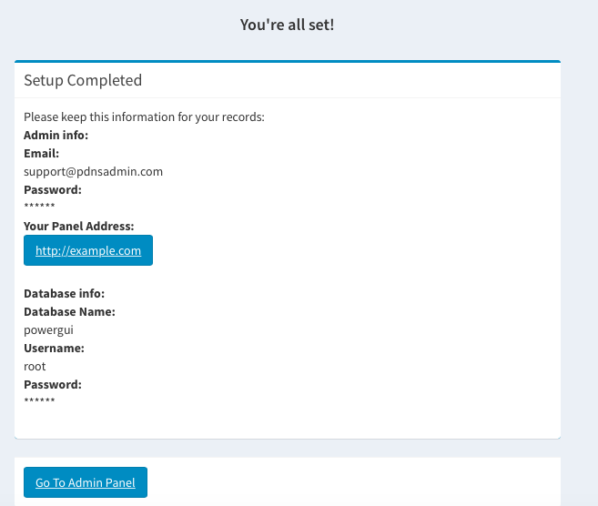

# Installation
This section describes how to install PdnsAdmin.

Step 1: The first thing you need to do to install PdnsAdmin manually is to download the latest installation package at https://github.com/pdnsadmin/pdnsadmin

Step 2: Next, you must upload the installation package on your hosting account through your cPanel -> File Manager or using an FTP client (copy the installation package to your "DocumentRoot" in your computer if you want to install PdnsAdmin on your local.)

Step 3: Create a MySQL database and assign a user to it. Remember the database details, since you will need them during the script installation. 

Step 4: Go through the PdnsAdmin installation process
In our example we will install PdnsAdmin for domain example.com. Once the package is uploaded  and you have a MySQL database, navigate to http://example.com/setup:

- System Requirements:
	+ Folder "uploads" must be writeable
	+ Database type: Mysql(>=Version 5.x)
	+ PHP:
		++ Version >= 5.5.9
		++ OpenSSL PHP Extension
		++ PDO PHP Extension
		++ Mbstring PHP Extension
		++ Tokenizer PHP Extension

- Database configuration:
	+ Database server Host
	+ Database server Username
	+ Database server Password
	+ Database Name
- [Powerdns](https://www.powerdns.com) configuration:
	+ Web configuration:
		++ Admin Name
		++ Email address
		++ Password
	+ Powerdns configuration:
		++ Host master
		++ Port
		++ Zone path
		++ Protocol
		++ Api key
		++ The value of the first NS-record
		++ The value of the second NS-record
		++ Hostmaster record
Create on the button "Create". and wait a few seconds..

Your PdnsAdmin installation was successfully completed. Now you can navigate to its Backend