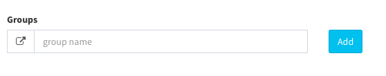

# User manual

Pdnsadmin user and user group to create different levels of access to the Admin, when your system is first step setup you receive a set of login credentails for the Administrator role(root) with the full permissions. However you can restrict a level of permission on a "need to know" basis for other people who work on your site. For example developer can be given access only list of domains page but not to area with setting page. Topics in this section include:

- Creating new users
- Creating group(custom role)

Creating new Users

When your system is first installed, your login credencials have with full administrative access. As the best practice, one of the first things you should do is to create another user account with full Administator permissions. That way your can use one account for your everyday. Administative activities and reserve other account as a "supper admin" in case you forget regular redencials or they somehow othewise unusable

If there are others on your team, or service providers who need access, you can create a separate
user account for each, and assign a restricted role. They cannot change any global settings or
data.

Create a New User and assign the roles

	1 On the left menu: Users --> click on the link  "Add"
	2 In the add new user section, do the following:

a) Login account & assign permissions.

	- Select group
	- Enter full name
	- Enter email for account

The email is your email. For example, if your email is “john@pdnsadmin.com” you can also log in as john@pdnsadmin.com”. This email address must be different from the one that is associated with your original Admin account

b) Complete the following information:

	- Job title
	- Phone number
	- Location

c) Assign a Password to the account.

The password should be seven or more characters long, and include both letters and numbers.

d) Root admin: if user is root admin, the account will have full permission

e) Complete the following information:

	- Signature
	- About me
	- Signature

Create group(custom roles)

- On the left menu: *Users --> Groups --> Enter group name --> click on button "Add"*

	

- Click on group you have just created and Set is allowed to "checked" on checkboxes

- When complete click on button "update"

	

